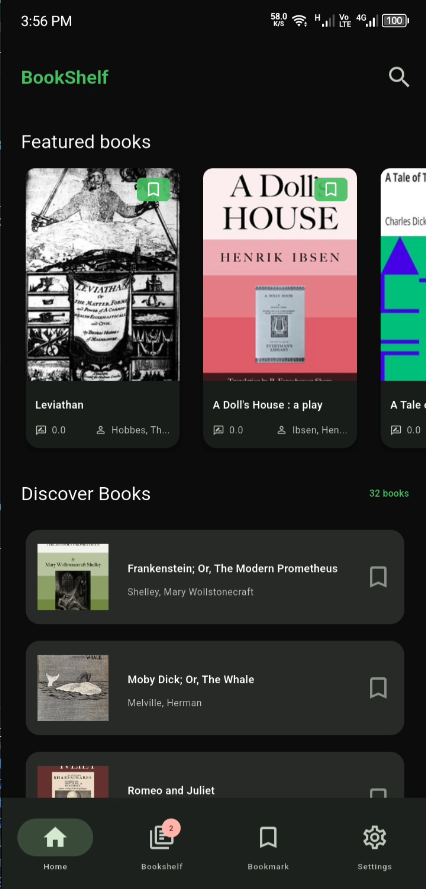
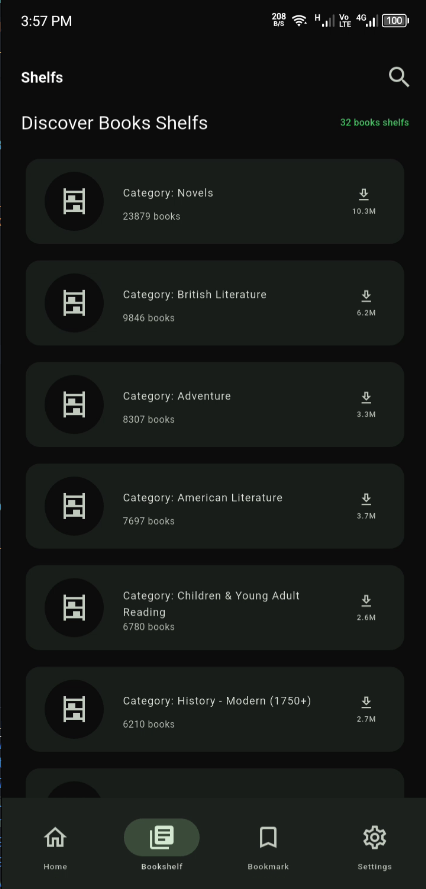
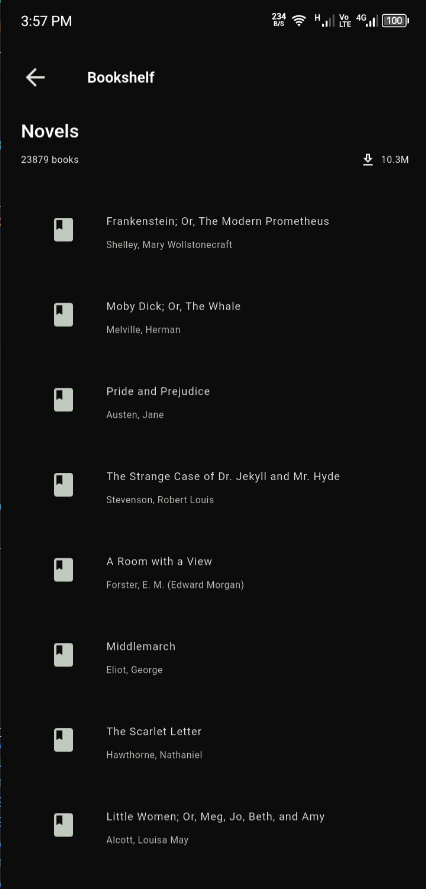

# BookShelf 📚

A modern Flutter application for discovering, managing, and reading digital books. BookShelf provides a beautiful and intuitive interface for browsing books from public digital libraries, with features for bookmarking favorites, organizing bookshelves, and personalized reading experiences.



## ✨ Features

### Core Functionality
- **📖 Book Discovery**: Browse and discover books from public digital libraries
- **🔖 Bookmark Management**: Save favorite books for quick access
- **📚 Bookshelf Organization**: Create and manage custom bookshelves
- **🔍 Search & Filter**: Find books by title, author, or subject
- **📱 Responsive Design**: Optimized for mobile, tablet, and desktop platforms
- **🌙 Dark/Light Theme**: Automatic theme switching based on system preferences

### Technical Features
- **📡 Offline Support**: Local data storage with Hive database
- **🔄 Real-time Sync**: Automatic synchronization with online book catalog
- **🌐 Network Awareness**: Smart handling of connectivity states
- **⚡ Performance Optimized**: Efficient loading with pagination and caching
- **🎨 Material Design 3**: Modern UI components and animations

## 🏗️ Architecture

### Clean Architecture Pattern
The application follows a clean architecture approach with clear separation of concerns:

```
lib/
├── core/                 # Core functionality, utilities, and configurations
│   ├── constants/        # App constants and strings
│   ├── network/          # Network handling and API client
│   ├── providers/        # Global providers and app-wide state
│   ├── routes/           # App routing configuration
│   ├── services/         # Core services (database, storage)
│   ├── theme/            # App theming and styling
│   └── utils/            # Utility functions and helpers
├── data/                 # Data layer implementation
│   ├── models/           # Data models and DTOs
│   └── repositories/     # Repository implementations
├── domain/               # Business logic layer
│   ├── entities/         # Core business entities
│   └── repositories/     # Repository interfaces
└── features/             # Feature modules
    ├── bookmark/         # Bookmark functionality
    ├── bookshelf/        # Bookshelf management
    ├── home/             # Home screen and book browsing
    ├── main/             # Main app shell and navigation
    ├── settings/         # App settings and preferences
    └── user/             # User profile and preferences
```

### State Management
- **Riverpod**: Reactive state management for predictable state updates
- **Provider Pattern**: Efficient widget-level state sharing
- **Async State Handling**: Built-in support for loading, error, and success states

### Data Layer
- **Repository Pattern**: Abstraction between data sources and business logic
- **Local Storage**: Hive database for offline data persistence
- **API Integration**: RESTful API integration with Dio HTTP client
- **Data Models**: Type-safe data models with JSON serialization

### Key Technologies
- **Flutter 3.x**: Cross-platform UI framework
- **Dart**: Programming language
- **Riverpod**: State management solution
- **Hive**: Lightweight and fast local database
- **Dio**: HTTP client for API requests
- **Material Design 3**: Modern UI component library

## 📱 Screenshots

### Home Screen

The main browsing interface featuring:
- Featured books carousel
- Comprehensive book list with cover images
- Search functionality
- Bookmark integration

### Book Details

Detailed book information including:
- Full book metadata (title, authors, subjects)
- Download count and publication date
- Reading ease score
- Available formats for download
- Bookmark toggle functionality

### Bookshelves

Bookshelf management interface featuring:
- Custom bookshelf creation
- Organization by categories
- Easy bookshelf navigation
- Bulk book management

### Bookshelf View

Individual bookshelf display with:
- Books within specific shelves
- Grid and list view options
- Quick access to book details
- Efficient pagination

## 🚀 Getting Started

### Prerequisites
- Flutter SDK 3.10.1 or higher
- Dart SDK 3.0 or higher
- Android Studio / VS Code with Flutter extensions
- Git

### Installation

1. **Clone the repository**
   ```bash
   git clone <repository-url>
   cd book_shelf
   ```

2. **Install dependencies**
   ```bash
   flutter pub get
   ```

3. **Set up environment variables**
   - Copy the example environment file:
     ```bash
     cp .env.example .env
     ```
   - Configure your API endpoints and keys in `.env`

4. **Generate code**
   ```bash
   flutter packages pub run build_runner build
   ```

5. **Run the application**
   ```bash
   flutter run
   ```

### Building for Production

**Android**
```bash
flutter build apk --release
```

**iOS**
```bash
flutter build ios --release
```

**Web**
```bash
flutter build web --release
```

## 📂 Project Structure

### Core Components

#### Entities
- **Book**: Core book entity with metadata, authors, and download information
- **Author**: Author information and details
- **Bookshelf**: Bookshelf organization and management

#### Services
- **DbClient**: Local database management using Hive
- **Network Service**: API communication and data fetching
- **Theme Service**: Dynamic theming and appearance management

#### Providers
- **Home Provider**: Manages home screen state and book loading
- **Bookmark Provider**: Handles bookmark operations
- **Bookshelf Provider**: Manages bookshelf state and operations
- **Settings Provider**: App settings and user preferences

### Configuration

#### Dependencies
Key dependencies include:
- `flutter_riverpod`: State management
- `dio`: HTTP client for API requests
- `hive` & `hive_flutter`: Local database
- `flutter_dotenv`: Environment variable management

#### Routes
The application uses named routes for navigation:
- `/splash`: Application splash screen
- `/home`: Main browsing interface
- `/bookshelf`: Bookshelf management
- `/settings`: Application settings
- `/book_details`: Detailed book information
- `/bookshelf_view`: Individual bookshelf display

## 🎯 Usage

### Browsing Books
1. Launch the app to see the home screen
2. Scroll through featured books or browse the complete catalog
3. Use the search icon to find specific books
4. Tap on any book to view detailed information

### Bookmarking Books
1. Navigate to any book (home screen or bookshelf)
2. Tap the bookmark icon to add/remove from favorites
3. Access bookmarked books through the bookmark section

### Managing Bookshelves
1. Go to the Bookshelf tab
2. Browse available bookshelves or create custom ones
3. View books within specific shelves
4. Organize books by category or genre

### Customizing Settings
1. Access settings from the main navigation
2. Toggle between dark and light themes
3. Configure app preferences and behavior

## 🔧 Development

### Code Generation
The project uses code generation for:
- Hive data adapters
- JSON serialization
- Resource generation

Run the following command to generate code:
```bash
flutter packages pub run build_runner build
```

### Testing
Run tests with:
```bash
flutter test
```

### Code Quality
The project uses Flutter lints for code quality:
```bash
flutter analyze
```

## 📄 License

This project is licensed under the MIT License - see the LICENSE file for details.

## 🤝 Contributing

Contributions are welcome! Please read our contributing guidelines and submit pull requests for any improvements.

## 📞 Support

For support and questions:
- Create an issue in the repository
- Contact the development team
- Check the documentation for common solutions

---

**BookShelf** - Making digital book discovery and management simple and beautiful.
